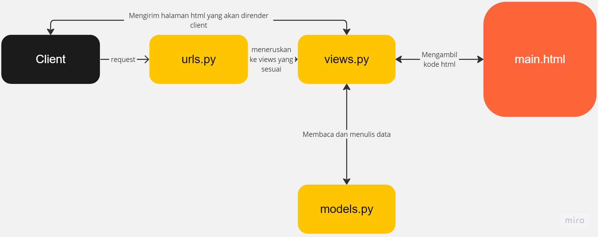
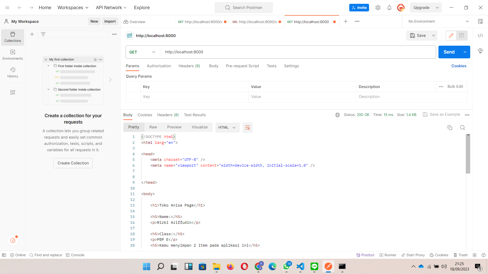
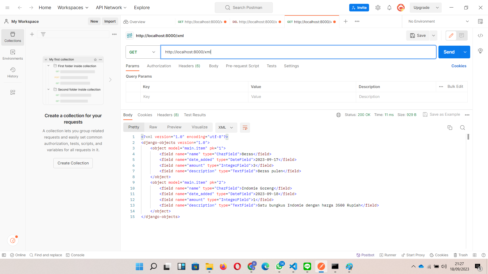
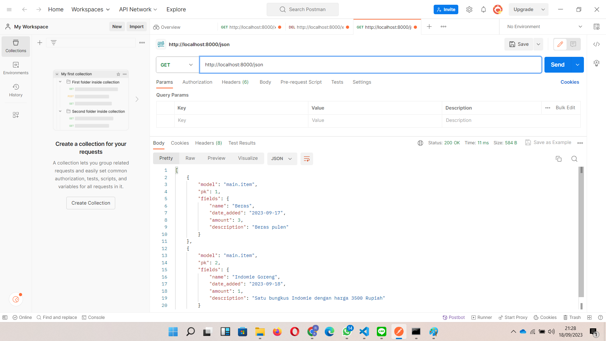
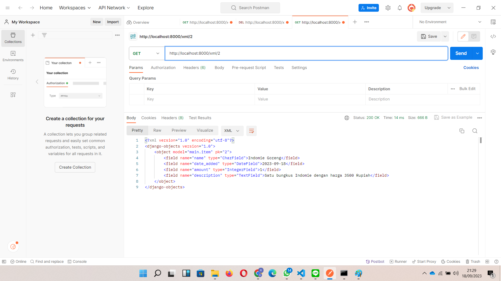
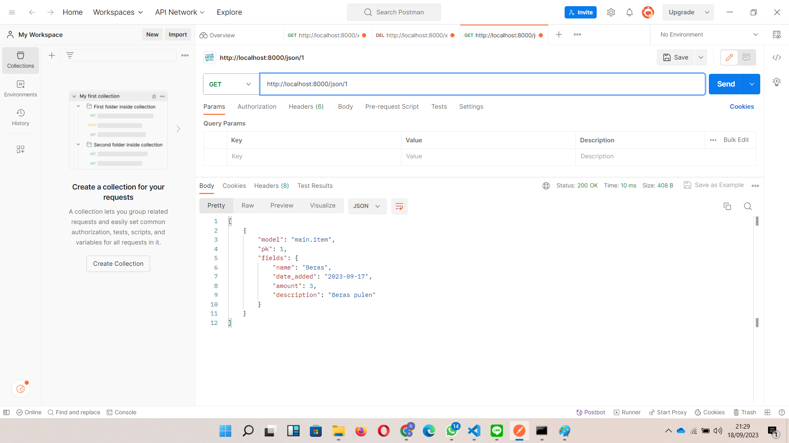
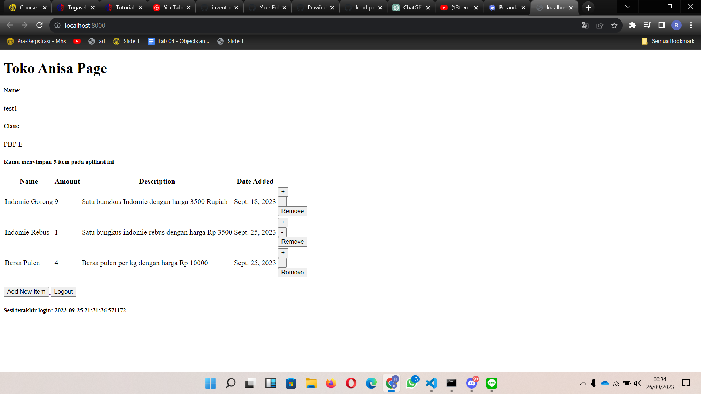
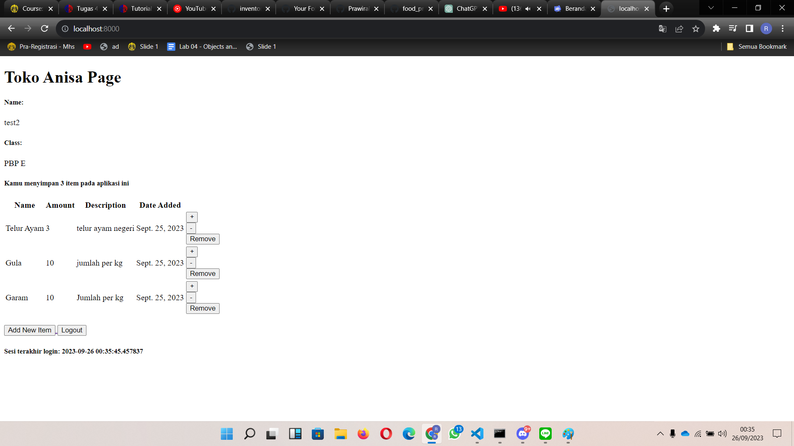

# Toko Anisa (Tugas Mata Kuliah Pemrograman Berbasis Platform Gasal 2023/2024)
Dibuat oleh:
Rizki Ariffudin
2206082612
PBP E

Tautan menuju aplikasi adaptable Toko Anisa dapat diakses melalui [tautan ini](http://rizki-ariffudin-tugas.pbp.cs.ui.ac.id/).

## Jelaskan bagaimana cara kamu mengimplementasikan checklist di atas secara step-by-step (bukan hanya sekadar mengikuti tutorial).
Dalam tugas kali ini, saya menggunakan OS Windows 11, sehingga semua perintah valid untuk versi Windows bukan Linux atau yang lainnya.
### **Membuat sebuah proyek Django baru**
1. Buat direktori baru dengan nama `toko_anisa` di local disk (C:) lalu buka command prompt, masuk ke dalam direktori tersebut menggunakan perintah `cd toko_anisa`.

2. Buat virtual environment dengan perintah `python -m venv env` untuk mengisolasi proyek Python kita dan aktifkan virtual environment dengan perintah `env\Scripts\activate.bat`.

3. Buat file `requirements.txt` di dalam direktori proyek dan isi dengan daftar dependencies yang dibutuhkan untuk proyek Anda.

4. Install dependencies dengan perintah `pip install -r requirements.txt`, kemudian buat proyek Django dengan menjalankan perintah `django-admin startproject (nama_app) .`. Nama_app disesuaikan dengan keinginan (kasus kali ini diisi dengan toko_anisa), dan ini akan membuat folder baru dengan nama tersebut.

5. Buka file `settings.py` yang ada di dalam folder proyek, cari variabel `ALLOWED_HOSTS` dan ubah nilainya menjadi `["*"]` untuk mengizinkan akses dari semua host.

6. Kembali ke command prompt atau terminal dan jalankan server dengan perintah `python manage.py runserver` di dalam direktori proyek (pastikan ada file `manage.py` di sana).

7. Kita dapat membuka proyek Django baru di browser dengan mengakses http://localhost:8000. Jika melihat animasi roket, maka proyek Django sudah berhasil.

8. Untuk menghentikan server, cukup tekan `Ctrl+C` di command prompt atau terminal. Jangan lupa untuk nonaktifkan virtual environment dengan perintah `deactivate`.

> [!NOTE]
> Jika ingin mengunggah proyek ke github, disarankan membuat file `.gitignore` untuk menentukan berkas dan direktori yang harus diabaikan oleh Git.


### **Membuat aplikasi dengan nama `main` pada proyek**
1. Buka command prompt pada direktori utama dan aktifkan virtual environment dengan perintah `env\Scripts\activate.bat`.

2. Jalankan perintah `python manage.py startapp main` untuk membuat aplikasi bernama `main`, secara otomatis folder `main` juga akan terbentuk.

3. Mendaftarkan aplikasi `main` ke proyek `toko_anisa` dengan membuka file `settings.py` dalam direktori proyek dan menambahkan `'main'` pada list `INSTALLED_APPS`.
    ```python
    INSTALLED_APPS = [
        ...,
        "main",
        ...
    ]
    ```
4. Membuat direktori `templates` di dalam direktori `main` dan membuat file ```main.html``` lalu isi file dengan kode berikut.
    ```html
    <h1>Toko Anisa Page</h1>

    <h5>Name: </h5>
    <p>{{ name }}<p>
    <h5>Class: </h5>
    <p>{{ class }}<p>
    ```

### **Melakukan routing pada proyek agar dapat menjalankan aplikasi ```main```**
1. Membuat file `urls.py` di dalam direktori `toko_anisa` untuk melakukan konfigurasi routing tampilan `main`, file diisi dengan kode berikut.
    ```python
    """
    URL configuration for toko_anisa project.

    The `urlpatterns` list routes URLs to views. For more information please see:
        https://docs.djangoproject.com/en/4.2/topics/http/urls/
    Examples:
    Function views
        1. Add an import:  from my_app import views
        2. Add a URL to urlpatterns:  path('', views.home, name='home')
    Class-based views
        1. Add an import:  from other_app.views import Home
        2. Add a URL to urlpatterns:  path('', Home.as_view(), name='home')
    Including another URLconf
        1. Import the include() function: from django.urls import include, path
        2. Add a URL to urlpatterns:  path('blog/', include('blog.urls'))
    """
    from django.contrib import admin
    from django.urls import path, include

    urlpatterns = [
        path('admin/', admin.site.urls),
        path('main/', include('main.urls')),
        path('', include('main.urls')),
    ]
    ```
### **Membuat model pada aplikasi main dengan nama Item**
1. Buka file `models.py` dan isi file tersebut dengan Class `Item` dan atribut-atribut dan tipe data yang ingin digunakan. Dalam program ini, ada 3 atribut wajib (name, amount, description).
``` python
from django.db import models

class Item(models.Model):
    name = models.CharField(max_length=255)
    amount = models.IntegerField()
    description = models.TextField()
```

2. Jalankan perintah `python manage.py makemigrations` untuk mempersiapkan migrasi skema model ke dalam database Django lokal.

3. Jalankan perintah `python manage.py migrate` untuk menerapkan skema model yang telah dibuat ke dalam database Django lokal.

> [!IMPORTANT]
> Setiap kali ada perubahan pada model (menambahkan / mengurangi / mengganti atribut), wajib untuk melakukan migrasi untuk merefleksikan perubahan itu


### **Cara membuat sebuah fungsi pada views.py untuk dikembalikan ke dalam sebuah template HTML**
1. Buat direktori baru bernama `templates` di dalam direktori aplikasi `main` dan buat file `main.html` di dalamnya

2. Buka file `views.py` dalam direktori `main` dan tambahkan `from django.shortcuts import render` untuk mengimpor fungsi render dari modul django.shortcuts untuk me-render tampilan HTML dengan menggunakan data yang diberikan.
```
from django.shortcuts import render
```

3. Buat fungsi `show_main` dengan 1 parameter (anggap namanya `request`) dan di dalam fungsinya, buat sebuah dictionary yang berisi data yang akan dikirimkan ke tampilan yang kemudian di return dengan fungsi `render` dengan 3 argumennya, yaitu `request` (objek permintaan HTTP yang dikirim oleh pengguna), nama file html yang digunakan untuk me-_render_ tampilan, dan `context` (dictionary yang berisi data untuk digunakan dalam penampilan dinamis)
```python
def show_main(request):
    context = {
        'name': 'Rizki Ariffudin',
        'class': 'PBP E'
    }

    return render(request, "main.html", context)
```

### **Membuat sebuah routing pada urls.py aplikasi `main` untuk memetakan fungsi yang telah dibuat pada views.py**
1. Melakukan konfigurasi routing URL aplikasi ```main``` dengan memodifikasi file ```urls.py``` di direktori ```main```.
```python
from django.urls import path
from main.views import show_main
```

2. Tambahkan urlpatterns untuk menghubungkan path dengan fungsi yang telah Anda buat di `views.py`, yaitu `show_main`
```python
app_name = 'main'

urlpatterns = [
    path('', show_main, name='show_main'),
]
```


### **Cara _deployment_ aplikasi ke Adaptable**
1. Pastikan proyek sudah diunggah ke GitHub dengan perintah ```git add .``` ```git commit -m "<pesan_commit>"``` ```git push -u origin <branch_utama>``` secara berurutan

2. Pertama - tama sign in akun Adaptable (jika belum punya) menggunakan akun GitHub, lalu log in pilih opsi "New App" dan "Connect an Existing Repository".

3. Hubungkan Adaptable.io dengan GitHub, pilih "All Repositories" (jika baru pertama kali menghubungkan).

4. Pilih repositori proyek aplikasi yang telah diunggah ke github dan branch untuk _deployment_.

5. Pilih template deployment "Python App Template" dan pilih PostgreSQL sebagai tipe basis data.

6. Sesuaikan versi Python dengan yang dibutuhkan (cek menggunakan perintah `python --version` pada command prompt).

7. Isi Start Command dengan `python manage.py migrate && gunicorn <nama_projek_django_kamu>.wsgi`.

8. Tentukan nama aplikasi yang juga akan menjadi nama domain situs web.

9. Centang "HTTP Listener on PORT" dan klik "Deploy App" untuk memulai proses deployment aplikasi.


## **Bagan yang berisi request client ke web aplikasi berbasis Django beserta responnya**

1. Client mengakses situs web dengan membuka browser
2. Client mengunjungi situs web, kemudian web server melayani permintaan dari Client 
3. URL Router mengalihkan URL proyek berdasarkan permintaan Client (```urls.py```), kemudian dialihkan ke fungsi yang sesuai berada di ```views.py``` 
4. Views (```views.py```) mengompilasi semua yang nantinya akan ditampilkan ke template ```html```
5. Context processor mengirimkan data dari ```views.py``` ke template ```html```
6. Template ```html``` menampilkan antarmuka depan proyek berdasarkan data konteks yang diambil dari ```views.py``` dan logika dari tag-tag template
7. ```models.py``` akan mengirim data yang diminta oleh ```views.py``` yang diambil dari database
8. ```views.py``` mengembalikan data yang didapat ke Client
9. Web server menampilkan respons dari server untuk disampaikan ke Client 
10. Client mendapatkan respons dari server web

## **Mengapa kita menggunakan virtual environment?**
Virtual environment adalah bagian penting dari pengembangan perangkat lunak Python, termasuk aplikasi web berbasis Django, karena mereka menyelesaikan tantangan pengelolaan proyek dengan spesifikasi yang bervariasi. Dengan menggunakan virtual environment, kami membuat lingkungan Python yang terisolasi untuk setiap proyek,  memungkinkan kami mengelola dependensi, versi Python, dan konfigurasi yang sesuai untuk proyek tersebut tanpa mengkhawatirkan konflik dengan proyek lain atau memengaruhi instalasi Python sistem. File 'requirements.txt' memungkinkan Anda menyimpan daftar dependensi yang diperlukan oleh proyek, sehingga memfasilitasi replikasi lingkungan pengembangan pada mesin yang berbeda. Hal ini tidak hanya penting bagi tim pengembangan dalam  menjaga konsistensi konfigurasi, tetapi juga membantu  manajemen ketergantungan yang efektif. Selain itu, virtual environment  membantu menjaga keamanan proyek dengan mengisolasi lingkungan dari perpustakaan atau komponen lain yang diinstal secara global atau di proyek lain, serta mencegah konflik yang mungkin timbul akibat penggunaan yang tidak diinginkan.


## **Apakah kita tetap dapat membuat aplikasi web berbasis Django tanpa menggunakan virtual environment?**
Meskipun secara teknis ini memungkinkan kita untuk membuat aplikasi web berbasis Django tanpa menggunakan virtual environment, ini tidak disarankan. Penggunaan virtual environment  dalam pengembangan Django merupakan standar yang sangat penting. Tanpa virtual environment, proyek akan bergantung pada sistem instalasi Python  yang ada di komputer Anda, yang dapat menyebabkan komplikasi. Salah satunya adalah konflik ketergantungan, dimana proyek yang berbeda memerlukan versi perpustakaan yang berbeda. Selain itu,  tanpa menggunakan virtual environment, Anda akan menghadapi tantangan dengan manajemen ketergantungan, ketergantungan keseluruhan pada lingkungan Python sistem, dan potensi masalah keamanan. Dengan menggunakan virtual environment, kami membuat lingkungan Python yang terisolasi untuk setiap proyek, memungkinkan  dependensi, versi Python, dan keamanan proyek dikelola secara independen. Hal ini juga mempermudah pengelolaan ketergantungan dan menghindari konflik antar proyek kami, sehingga menjaga kebersihan, stabilitas, dan keamanan selama pengembangan proyek di masa mendatang.


## **Jelaskan apakah itu MVC, MVT, MVVM dan perbedaan dari ketiganya**
MVC (Model-View-Controller), MVT (Model-View-Template) dan MVVM (Model-View-ViewModel) adalah pola arsitektur perangkat lunak yang digunakan dalam pengembangan aplikasi untuk memisahkan komponen aplikasi dari berbagai aplikasi  agar lebih terstruktur dan sederhana. untuk mengelola. Meskipun keduanya memiliki kesamaan dalam alokasi tugas, namun digunakan dalam konteks yang berbeda dan terdapat perbedaan dalam cara pengorganisasian komponen-komponen ini.

Pada MVC, MVT, dan MVVM ketiganya memiliki kesamaan dalam struktur, yaitu terdapat model dan view:
1. Model --> Bagian yang mengelola data dari aplikasi. Mulai dari mengakses, memanipulasi, validasi, hingga perhitungan dari data yang dimiliki aplikasi maupun dari sumber lain.
2. View --> Bagian yang mengelola tampilan untuk diberikan kepada pengguna ketika menggunakan aplikasi. View akan mengakses data-data melalui model lalu data tersebut ditampilkan ke layar pengguna.


### MVC (Model - View - Controller)
| **Model** | **View** | **Controller** |
| --- | --- | --- |
| Menyajikan data aplikasi dan aturan bisnis. Ini adalah pihak yang bertanggung jawab untuk mengakses dan memanipulasi data, baik dari database atau sumber lain. Model juga mendefinisikan logika bisnis, seperti validasi  dan perhitungan data. Misalnya, jika kita ingin mengembangkan aplikasi e-commerce, modelnya mengatur bagaimana data produk, pelanggan, dan pesanan disimpan dan diakses. | Bagian manajemen ditampilkan kepada pengguna. Inilah yang dilihat pengguna saat berinteraksi dengan aplikasi yang kita buat. Tugas View hanyalah mengekstrak data dari model dan menampilkannya di layar. Misalnya, dalam aplikasi e-commerce, tampilan akan menampilkan daftar produk dan detail pesanan kepada pengguna. | Bagian  perantara antara model dan tampilan. Ini mengelola aliran informasi dalam aplikasi. Controller menangani permintaan pengguna, memprosesnya, dan mengirimkannya ke model untuk memperbarui data atau mengambil data yang diperlukan. Misalnya pada aplikasi e-commerce. Jika pengguna menambahkan produk ke keranjang, controller akan meminta model untuk menyimpan data ini dan kemudian meminta tampilan untuk memperbarui tampilan. |

### MVT (Model - View - Template)
| **Model** | **View** | **Template** |
| --- | --- | --- |
| Seperti MVC, model adalah komponen konsep MVT yang bertanggung jawab untuk mengatur dan mengelola data aplikasi. Model mewakili struktur data dan logika aplikasi di balik tampilan. Model menghubungkan aplikasi ke database dan mengelola interaksi dengan data tersebut. | Logika presentasi disusun berdasarkan komponen-komponen dalam konsep MVT. Tampilan ini mengontrol cara data yang dikelola model ditampilkan kepada pengguna. Dalam konteks MVT, tampilan bertindak sebagai pengatur yang menampilkan dan mengambil informasi dari model untuk disajikan kepada pengguna. | Bagian yang bertanggung jawab untuk mengelola layar pengguna, misalnya halaman web. Dalam kerangka kerja seperti Django, template digunakan untuk merancang tata letak halaman web dan menggabungkan data dari template sehingga pengguna dapat melihat data yang dihasilkan melalui tampilan. |

### MVVM (Model - View - ViewModel)
| **Model** | **View** | **ViewModel** |
| --- | --- | --- |
| Komponen yang mengelola data dan logika aplikasi, mirip dengan pola MVC dan MVT. Model dan ViewModel di MVVM  bekerja sama untuk mengambil dan menyimpan data | Komponen yang  menampilkan tampilan dan memberi tahu ViewModel tentang tindakan pengguna. Namun, di MVVM, View bertindak sebagai penampil pasif yang hanya menampilkan data dan tidak berisi logika aplikasi apa pun. | Salah satu komponen utama MVVM, yang bertindak sebagai jembatan antara model dan view. ViewModel mengonversi data model ke dalam format yang dapat ditampilkan oleh view dan mengelola logika tampilan. Misalnya, jika kita memiliki program cuaca, ViewModel  mengambil informasi cuaca dari model dan mengubahnya menjadi format yang dapat ditampilkan oleh tampilan, seperti simbol cuaca, suhu, dan deskripsi. |

### Perbedaan MVC, MVT, dan MVVM
#### MVC
MVC adalah pola desain yang  digunakan dalam berbagai aplikasi termasuk aplikasi desktop, web, dan seluler. Ini adalah konsep yang serbaguna dan tersebar luas. Di MVC, Controller memainkan peran yang cukup aktif dalam mengelola aliran data antara Model dan View. Dalam beberapa kasus, model dan view juga dapat berinteraksi secara langsung. Dengan kata lain, MVC berfokus pada pemisahan tugas dengan model yang mengelola data dan logika bisnis, view yang menampilkan data, dan pengontrol yang mengelola aliran data. Dengan MVC, pengembang sering kali harus  mengelola pembaruan tampilan secara manual saat data berubah. Ini mungkin memerlukan kode tambahan untuk menghubungkan model ke view.

#### MVT
MVT adalah konsep yang terutama digunakan dalam pengembangan web  menggunakan kerangka  Django  berbasis Python. Salah satu komponen khusus, yaitu Template (dalam MVT (Django)), didedikasikan untuk mengelola tampilan halaman web, sedangkan Model dan View berfungsi seperti di MVC. Template adalah komponen tambahan yang tidak ada di MVC tradisional, dan (_frameworks_) ini memiliki alat bawaan yang memastikan tampilan diperbarui secara otomatis ketika data berubah.

#### MVVM
MVVM banyak digunakan pada aplikasi berbasis UI seperti aplikasi mobile atau desktop. Fokusnya adalah memisahkan  tampilan dan tugas logis di antarmuka pengguna. ViewModel  bertindak sebagai perantara antara Model dan View, menjaga keduanya  tetap terpisah dan mengurangi ketergantungan di antara keduanya. MVVM ini didasarkan pada sistem pengikatan data yang secara otomatis memperbarui tampilan ketika data dalam ViewModel berubah. Hal ini mengurangi kode tambahan yang diperlukan untuk melihat pembaruan. Namun, jika pengikatan data sangat rumit, proses debug aplikasi bisa menjadi sedikit lebih sulit.

## BONUS
Saya menambahkan satu testing, yaitu unit testing. Tujuan dari testing ini adalah untuk mengecek model dan attribut yang dimiliki oleh aplikasi dapat berjalan atau tidak. Berikut adalah kode yang saya terapkan di ```test.py```
```python
from django.test import TestCase, Client
from main.models import Item

class mainTest(TestCase):
    def test_main_url_is_exist(self):
        response = Client().get('/main/')
        self.assertEqual(response.status_code, 200)

    def test_main_using_main_template(self):
        response = Client().get('/main/')
        self.assertTemplateUsed(response, 'main.html')

    def test_create_instance(self):
        # Create an instance of Item
        my_model = Item(name="Roti", amount=10, description="Roti bakar enak")

        # Verify that the attributes match what you set
        self.assertEqual(my_model.name, "Roti")
        self.assertEqual(my_model.amount, 10)
        self.assertEqual(my_model.description, "Roti bakar enak")

    def test_save_and_retrieve(self):
        # Create an instance of Item
        my_model = Item(name="Pisang", amount=15, description="Pisang coklat")

        # Save it to the database
        my_model.save()

        # Retrieve the object from the database
        retrieved_model = Item.objects.get(name="Pisang")

        # Verify that the retrieved object matches the saved object
        self.assertEqual(retrieved_model.name, "Pisang")
        self.assertEqual(retrieved_model.amount, 15)
        self.assertEqual(retrieved_model.description, "Pisang coklat")
```

# Tugas 3: Implementasi Form dan Data Delivery pada Django
## Membuat input ```form``` untuk menambahkan objek model pada app sebelumnya.
1. Menyalakan _virtual environment_ menggunakan command prompt pada direktori dengan perintah ```env\Scripts\activate.bat```
2. Sebelum membuat input form, kita harus membuat suatu _skeleton_ yang berfungsi sebagai kerangka views dari web yang kita buat. Tujuan dari pembuatan kerangka ini adalah untuk menghindari redundansi kode dan mempertahankan konsistensi desain web kita. Berikut akan dijelaskan cara membuat _skeleton_.
3. Buat folder `templates` di folder utama atau terluar (toko_anisa). Lalu buat berkas HTML bernama `base.html` yang berfungsi sebagai _template_ dasar untuk halaman web lainnya di dalam proyek. Masukan kode berikut ke `base.html`
```html

<!DOCTYPE html>
<html lang="en">
    <head>
        <meta charset="UTF-8" />
        <meta
            name="viewport"
            content="width=device-width, initial-scale=1.0"
        />
        
        
    </head>

    <body>
        
        
    </body>
</html>
```
4. Buka `settings.py` yang ada di subdirektori `toko_anisa` lalu tambahkan kode berikut pada baris `TEMPLATES` agar `base.html` dapat terdeteksi.
```html
...
TEMPLATES = [
    {
        'BACKEND': 'django.template.backends.django.DjangoTemplates',
        'DIRS': [BASE_DIR / 'templates'], # Tambahkan kode ini
        'APP_DIRS': True,
        ...
    }
]
...
```
5. Buka berkas `main.html` yang ada di direktori `main/templates` dan ubah isinya menjadi kode berikut.
```html



    <h1>Shopping List Page</h1>

    <h5>Name:</h5>
    <p>{{name}}</p>

    <h5>Class:</h5>
    <p>{{class}}</p>

```
6. Step 5 adalah akhir dari pembuatan _skeleton_. Selanjutnya untuk membuat input form, pertama-tama buat berkas baru di direktori `main` dengan nama `forms.py` untuk membuat struktur form yang menerima data produk baru. Isi berkas dengan kode berikut.
```python
from django.forms import ModelForm
from main.models import Product

class ProductForm(ModelForm):
    class Meta:
        model = Item
        fields = ["name", "Amount", "description"]
```
7. Buka `views.py` di direktori `main` lalu tambahkan beberapa _import_ dan fungsi `create_product` serta ubah fungsi `show_main`. Sehingga isi dari berkas adalah sebagai berikut.
```python
from django.shortcuts import render
from django.http import HttpResponseRedirect
from main.forms import ProductForm
from django.urls import reverse
from main.forms import Item
from main.models import Item  # Import your Product model

# Ubah show_main
def show_main(request):
    products = Item.objects.all()

    context = {
        'name': 'Rizki Ariffudin', # Nama kamu
        'class': 'PBP E', # Kelas PBP kamu
        'products': products,
        'total_items': len(products) # Untuk BONUS, membaca total items di database yang sudah disimpan 
    }

    return render(request, "main.html", context)

# Fungsi baru
def create_product(request):
    form = ProductForm(request.POST or None)

    if form.is_valid() and request.method == "POST":
        form.save()
        return HttpResponseRedirect(reverse('main:show_main'))

    context = {'form': form}
    return render(request, "create_product.html", context)
```
8. Buka `urls.py` di direktori `main` import fungsi `create_product` yang dibuat dan tambahkan _path url_ ke `urlpatterns`. Berikut kode yang perlu ditambahkan.
```python
from main.views import show_main, create_product # import fungsi create_product

...

path('create-product', create_product, name='create_product'), # tambahkan ke urlpatterns
```
9. Buat berkas HTML baru dengan nama `create_product.html` di direktori `main/templates`. Isi berkas dengan kode berikut.
```html
 


<h1>Add New Product</h1>

<form method="POST">
    
    <table>
        {{ form.as_table }}
        <tr>
            <td></td>
            <td>
                <input type="submit" value="Add Product"/>
            </td>
        </tr>
    </table>
</form>


```
10. Buka `main.html` tambahkan kode berikut ke dalam block `` agar data produk dalam bentuk tabel serta tombol *Add New Product* yang akan _redirect_ ke halaman form.
```html
    <table>
        <tr>
            <th>Name</th>
            <th>Amount</th>
            <th>Description</th>
            <th>Date Added</th>
        </tr>
    
         Berikut cara memperlihatkan data produk di bawah baris ini 
    
        
            <tr>
                <td>{{product.name}}</td>
                <td>{{product.amount}}</td>
                <td>{{product.description}}</td>
                <td>{{product.date_added}}</td>
            </tr>
        
    </table>
    
    <br />
    
    <a href="">
        <button>
            Add New Product
        </button>
    </a>

```

## Tambahkan 5 fungsi views untuk melihat objek yang sudah ditambahkan dalam format HTML, XML, JSON, XML by ID, dan JSON by ID. Serta routing URL untuk masing-masing views yang telah ditambahkan.
### XML
1. Buka file `main/views.py`, kemudian import `HttpResponse` dan `Serializer` dan tambahkan function `show_xml`
```py
from django.http import HttpResponse
from django.core import serializers
...
def show_xml(request):
    data = Item.objects.all()
    return HttpResponse(serializers.serialize("xml", data), content_type="application/xml")
```
> [!NOTE]
> serializers digunakan untuk translate objek model menjadi format lain.

2. Buka `main/urls.py` untuk import function `show_xml` dan tambahkan routing url ke url patterns sebagai akses menuju fungsi tersebut
```py
from main.views import show_main, create_item, show_xml
...
urlpatterns = [
    ...
    path('xml/', show_xml, name='show_xml'),
    ...
]
```

### JSON
1. Buka file `views.py` pada folder `main` dan buat fungsi `show_json` yang menerima parameter `request`
```py
def show_json(request):
    data = Item.objects.all()
    return HttpResponse(serializers.serialize("json", data), content_type="application/json")
```

2. Buka `urls.py` yang ada pada folder `main` dan import fungsi yang sudah dibuat tadi `(show_json)` dan tambahkan path url ke dalam urlpatterns untuk mengakses fungsi yang diimpor tadi
```py
from main.views import show_main, create_item, show_xml, show_json
...
urlpatterns = [
    ...
    path('json/', show_json, name='show_json'),
    ...
]
```

### XML and JSON by ID
1. Buka kembali folder `main` dan akses file `urls.py`, kemudian buat function baru, `show_xml_by_id` dan `show_json_by_id` dengan mengembalikan function berupa `HttpResponse` yang berisi parameter data hasil query yang sudah diserialisasi menjadi JSON atau XML dan parameter `content_type`
```py
...
def show_xml_by_id(request, id):
    data = Item.objects.filter(pk=id)
    return HttpResponse(serializers.serialize("xml", data), content_type="application/xml")

def show_json_by_id(request, id):
    data = Item.objects.filter(pk=id)
    return HttpResponse(serializers.serialize("json", data), content_type="application/json")
...
```

2. Buka `urls.py` yang ada pada folder `main` dan import fungsi yang sudah dibuat tadi, yaitu `show_xml_by_id` dan `show_json_by_id`, kemudian perbarui path url yang di dalam urlpatterns untuk mengakses kedua fungsi tersebut.
```py
from django.urls import path
from main.views import show_main, create_item, show_xml, show_json, show_xml_by_id, show_json_by_id 

app_name = 'main'

urlpatterns = [
    path('', show_main, name='show_main'),
    path('create-item', create_item, name='create_item'),
    path('xml/', show_xml, name='show_xml'),
    path('json/', show_json, name='show_json'),
    path('xml/<int:id>/', show_xml_by_id, name='show_xml_by_id'),
    path('json/<int:id>/', show_json_by_id, name='show_json_by_id'),
]
```
## Perbedaan antara form POST dan form GET dalam Django
Terdapat dua jenis method form yang dapat digunakan dalam Django, yaitu POST dan GET. Keduanya memiliki fungsi yang sama, yaitu mengambil data yang diisi user pada form lalu menyimpan data tersebut pada database. Akan tetapi, keduanya memiliki karakteristik masing-masing, yaitu sebagai berikut:
| **POST** | **GET** |
| --- | --- |
| Data pada _form_ akan dibaca dan dilakukan _encode_ kepada data tersebut untuk keperluan transmisi, lalu dikirim secara internal kepada server tanpa menampilkan parameter dari URL. Sehingga data lebih aman karena tidak sembarang orang dapat melakukan akses ke data tersebut. | Data pada form akan dibaca dan dikirim ke server sebagai _string_ yang merupakan parameter URL. Sehingga seluruh data yang dibaca menggunakan method GET bisa terlihat oleh siapapun melalui URL |
| Sebuah _request_ yang memberikan dampak kepada database dan system harus menggunakan POST | GET digunakan untuk _request_ yang tidak punya pengaruh kepada system. |
| Cocok digunakan untuk memperoleh _Login Data_ seperti _password_, data yang sangat besar, dan _binary data_ seperti gambar | Cocok digunakan untuk keperluan yang hanya mengakses sesuatu yang sudah ada di website seperti _web search form_. |

## Perbedaan utama antara XML, JSON, dan HTML dalam konteks pengiriman data
Secara singkat, XML cocok untuk pertukaran data yang sangat terstruktur dan ketat, JSON cocok untuk pertukaran data yang lebih sederhana dan efisien dalam konteks aplikasi web, sedangkan HTML adalah bahasa markup yang digunakan untuk membuat tampilan halaman web yang bisa diakses oleh manusia.

XML adalah bahasa markup yang dirancang untuk menyimpan dan mengirim data dengan struktur yang kuat dan sangat terstruktur. XML menggunakan tag-tag yang mendefinisikan elemen-elemen data dan atribut-atribut untuk memberikan informasi tambahan tentang elemen-elemen tersebut. XML sangat kuat dalam mendefinisikan skema data yang ketat, yang membuatnya cocok untuk pertukaran data yang kompleks seperti data konfigurasi, data yang harus divalidasi dengan ketat, atau dalam format data yang bisa dibaca oleh mesin. Namun, XML memiliki overhead dalam hal ukuran file karena strukturnya yang kuat, dan parsing XML memerlukan penggunaan sumber daya komputasi yang signifikan.

JSON adalah format pertukaran data yang lebih ringan dan mudah dibaca oleh mesin. JSON menggunakan struktur objek dan array yang lebih sederhana daripada XML, membuatnya ideal untuk pertukaran data yang cepat dan efisien. JSON sangat populer dalam pengembangan aplikasi web modern karena dapat diurai (parsed) dan dihasilkan (serialized) dengan mudah dalam banyak bahasa pemrograman. JSON juga mendukung berbagai jenis data, termasuk teks, angka, objek, array, dan boolean, menjadikannya format yang serbaguna untuk pertukaran data antara klien dan server. Namun, JSON tidak memiliki dukungan bawaan untuk definisi skema data yang kuat, yang dapat menyebabkan masalah kompatibilitas jika tidak dikelola dengan baik.

HTML adalah bahasa markup yang dirancang khusus untuk membuat dan mengatur konten web yang dapat diakses oleh manusia melalui peramban web. HTML tidak biasanya digunakan untuk pertukaran data struktural antara aplikasi, tetapi digunakan untuk membuat tampilan dan struktur halaman web. Namun, HTML memiliki kemampuan untuk menyematkan data dalam atribut atau elemen tertentu dan, dengan bantuan JavaScript, data ini dapat diakses oleh aplikasi web dan digunakan untuk interaksi klien-sisi. HTML adalah dasar dari web, dan semua halaman web modern menggunakan HTML sebagai struktur dasarnya.

## Alasan JSON sering digunakan dalam pertukaran data antara aplikasi web modern
JSON dengan format teks ringan dan fleksibilitas struktur data, memudahkan pengembang dalam memahami, mengelola, dan merepresentasikan data kompleks. Dukungan interoperabilitasnya di banyak bahasa pemrograman dan platform membuatnya serbaguna, digunakan secara luas dalam aplikasi web modern, terutama dalam berinteraksi dengan layanan web dan API eksternal. JSON juga menawarkan fitur keamanan yang mengurangi risiko serangan injeksi kode. Dalam konteks aplikasi real-time, JSON memungkinkan pembaruan data efisien antara klien dan server, meningkatkan pengalaman pengguna. Dukungan luas dari kerangka kerja dan perpustakaan web menjadikannya alat penting dalam pengembangan aplikasi web.

## Screenshot hasil akses URL pada Postman
### HTML


### XML


### JSON


### XML by ID (Case ID = 2)


### JSON by ID (Case ID = 1)


## BONUS: Menambahkan pesan "Kamu menyimpan X item pada aplikasi ini" (dengan X adalah jumlah data item yang tersimpan pada aplikasi) dan menampilkannya di atas tabel data.
Untuk melakukan hal ini, kita perlu mengambil total item yang sudah dibuat di database. tambahkan kode berikut di berkas `views.py` di direktori `main`
```python
from main.models import Item  # Import your Product model

# Ubah show_main
def show_main(request):
    products = Item.objects.all()

    context = {
        'name': 'Rizki Ariffudin', # Nama kamu
        'class': 'PBP E', # Kelas PBP kamu
        'products': products,
        'total_items': len(products) # Untuk BONUS, syntax len akan mereturn jumlah products yang ada di database
    }

    return render(request, "main.html", context)
```
Setelah itu, kita ke berkas `main.html` yang ada di direktori `main/templates` dan ubah berkas menjadi sebagai berikut/
```html



    <h1>Toko Anisa Page</h1>

    <h5>Name:</h5>
    <p>{{name}}</p>

    <h5>Class:</h5>
    <p>{{class}}</p>
    <h5>Kamu menyimpan {{total_items}} item pada aplikasi ini</h5> # Untuk BONUS, tambahkan kode ini untuk menampilkan total items di halaman web
    <table>
        <tr>
            <th>Name</th>
            <th>Amount</th>
            <th>Description</th>
            <th>Date Added</th>
        </tr>
    
         Berikut cara memperlihatkan data produk di bawah baris ini 
    
        
            <tr>
                <td>{{product.name}}</td>
                <td>{{product.amount}}</td>
                <td>{{product.description}}</td>
                <td>{{product.date_added}}</td>
            </tr>
        
    </table>
    
    <br />
    
    <a href="">
        <button>
            Add New Product
        </button>
    </a>

```

# Tugas 4: Implementasi Autentikasi, Session, dan Cookies pada Django
## Mengimplementasikan fungsi registrasi, login, dan logout untuk memungkinkan pengguna untuk mengakses aplikasi sebelumnya dengan lancar.
1. Jalankan _virtual environment_ terlebih dahulu dengan membuka root direktori di command prompt dan ketik `env\Scripts\activate.bat`
2. Buka `views.py` yang ada di subdirektori `main` lalu tambahkan beberapa import berikut.
**Untuk registrasi**
```python
from django.shortcuts import redirect
from django.contrib.auth.forms import UserCreationForm
from django.contrib import messages  
```
**Untuk login**
```python
from django.contrib.auth import authenticate, login
```
**Untuk Logout**
```python
from django.contrib.auth import logout
```
3. Buatlah fungsi `register`, `login`, dan `logout` lalu isi fungsi tersebut dengan kode berikut.
**Untuk registrasi**
```python
def register(request):
    form = UserCreationForm()

    if request.method == "POST":
        form = UserCreationForm(request.POST)
        if form.is_valid():
            form.save()
            messages.success(request, 'Your account has been successfully created!')
            return redirect('main:login')
    context = {'form':form}
    return render(request, 'register.html', context)
```
**Untuk Login**
```python
def login_user(request):
    if request.method == 'POST':
        username = request.POST.get('username')
        password = request.POST.get('password')
        user = authenticate(request, username=username, password=password)
        if user is not None:
            login(request, user)
            return redirect('main:show_main')
        else:
            messages.info(request, 'Sorry, incorrect username or password. Please try again.')
    context = {}
    return render(request, 'login.html', context)
```
**Untuk Logout**
```python
def logout_user(request):
    logout(request)
    return redirect('main:login')
```
4. Buat berkas HTML dengan nama `register.html` dan `login.html`di direktori `main/templates` lalu isi dengan kode berikut.
**Isi `register.html`**
```html



    <title>Register</title>


  

<div class = "login">
    
    <h1>Register</h1>  

        <form method="POST" >  
              
            <table>  
                {{ form.as_table }}  
                <tr>  
                    <td></td>
                    <td><input type="submit" name="submit" value="Daftar"/></td>  
                </tr>  
            </table>  
        </form>

      
        <ul>   
              
                <li>{{ message }}</li>  
                  
        </ul>   
    

</div>  


```
**Isi `login.html`**
```html



    <title>Login</title>




<div class = "login">

    <h1>Login</h1>

    <form method="POST" action="">
        
        <table>
            <tr>
                <td>Username: </td>
                <td><input type="text" name="username" placeholder="Username" class="form-control"></td>
            </tr>
                    
            <tr>
                <td>Password: </td>
                <td><input type="password" name="password" placeholder="Password" class="form-control"></td>
            </tr>

            <tr>
                <td></td>
                <td><input class="btn login_btn" type="submit" value="Login"></td>
            </tr>
        </table>
    </form>

    
        <ul>
            
                <li>{{ message }}</li>
            
        </ul>
         
        
    Don't have an account yet? <a href="">Register Now</a>

</div>


```
5. Buka berkas `main.html` yang ada di direktori `main/templates` lalu tambahkan potongan kode di bawah _hyperlink tag_ untuk _Add New Item_
```html
...
<a href="">
    <button>
        Logout
    </button>
</a>
...
```
6. Buka `urls.py` yang ada di direktori `main` lalu impor fungsi yang sudah dibuat tadi.
**Untuk `registrasi`**
```python
from main.views import register #sesuaikan dengan nama fungsi yang dibuat
```
**Untuk `login`**
```python
from main.views import login_user #sesuaikan dengan nama fungsi yang dibuat
```
**Untuk `logout`**
```python
from main.views import logout_user
```
7. Tambahkan _path url_ ke dalam `urlpatterns` agar fungsi yang baru dibuat tadi dapat diakses.
```python
...
path('register/', register, name='register'), #sesuaikan dengan nama fungsi yang dibuat
path('login/', login_user, name='login'), #sesuaikan dengan nama fungsi yang dibuat
path('logout/', logout_user, name='logout'),
...
```

## Membuat dua akun pengguna dengan masing-masing tiga dummy data menggunakan model yang telah dibuat pada aplikasi sebelumnya untuk setiap akun di lokal.
Sudah dilakukan, berikut bukti SS dari akun tersebut.
**Akun 1**

**Akun 2**


## Menghubungkan model Item dengan User
1. Mengimpor model `User` dari `django.contrib.auth.models` ke dalam `models.py` di subdirektori `main`
2. Menambahkan field `user` dengan tipe data `ForeignKey` pada model `Item` untuk menghubungkan produk dengan pengguna yang membuatnya.
3. Mengubah fungsi `create_item` untuk mengisi field user dengan pengguna yang sedang login sebelum menyimpan item.
4. Mengubah fungsi `show_main` untuk menampilkan item yang terasosiasi dengan pengguna yang sedang login.
5. Melakukan `makemigrations` model untuk mengaplikasikan perubahan pada basis data.
6. Jika terjadi error saat proses migrasi, terapkan _default value_ dengan memilih option **1** lalu ketik angka **1** lagi untuk menetapkan ID _user_ yang sudah dibuat sebelumnya.
7. Lanjutkan proses migrasi dengan `migrate` agar perubahan diterapkan pada basis data.

## Menampilkan detail informasi pengguna yang sedang logged in seperti username dan menerapkan cookies seperti last login pada halaman utama aplikasi.
Untuk dapat menampilkan detail informasi pengguna yang sedang logged in, kita perlu menerapkan `cookies` terlebih dahulu. Berikut adalah caranya
1. Impor Modul `HttpResponseRedirect`, `reverse`, dan `datetime`
2. Dalam fungsi `login_user` gunakan `login(request, user)` untuk login pengguna, buat objek response dengan `HttpResponseRedirect`, set cookie `last_login` dengan waktu login terakhir, dan kembalikan objek `response`.
3. Menampilkan Data Cookie di Halaman Utama, yaitu dalam fungsi `show_main`, tambahkan `'last_login': request.COOKIES['last_login']`, ke dalam `context` untuk menampilkan detail informasi pengguna yang sedang logged in.
3. Ubah `logout_user` untuk menghapus cookie `last_login` saat logout dengan menggunakan `response.delete_cookie('last_login')` untuk menghapus cookie tersebut.

## Apa itu Django UserCreationForm, dan jelaskan apa kelebihan dan kekurangannya?
Pada framework Django, terdapat `UserCreationForm` yang dapat digunakan untuk membuat sebuah formulir yang dirancang untuk dapat mengumpulkan informasi yang dibutuhkan dalam pembuatan akun _user_ baru, seperti _username_ dan _password_, serta informasi tambahan lainnya seperti email.
### Kelebihan:
1. **Mudah Digunakan**
`UserCreationForm` menyediakan fungsi-fungsi yang sudah terdefinisi dengan baik, sehingga memudahkan pengembang web dalam mengimplementasikan fitur pendaftaran _user_ baru dengan cepat.
2. **Validasi Bawaan**
Form ini sudah dilengkapi dengan validasi bawaan, termasuk validasi untuk memastikan bahwa kata sandi yang dimasukkan cukup kuat dan tidak ada _user_ dengan _username_ yang sama.
3. **Fungsionalitas yang Dapat Disesuaikan**
Meskipun sudah memiliki fitur pendaftaran bawaan, `UserCreationForm` dapat dengan mudah disesuaikan sesuai kebutuhan aplikasi. _developer_ dapat menambahkan atau menghapus bidang-bidang tambahan yang diperlukan atau mengubah validasi sesuai dengan kebijakan keamanan aplikasi yang dibuat.
### Kekurangan:
1. **Tidak Sesuai untuk Kasus Khusus** 
Jika aplikasi memiliki kebutuhan pendaftaran yang khusus, `UserCreationForm` mungkin tidak cukup fleksibel contohnya jika ingin mengaitkan informasi pendaftaran dengan aplikasi pihak ketiga. Oleh karena itu, `UserCreationForm` tidak akan bisa dipakai disemua aplikasi.
2. **Tidak Mengatasi Semua Aspek Keamanan**
Meskipun UserCreationForm menyediakan beberapa validasi bawaan, itu tidak mengatasi semua aspek keamanan. _Developer_ masih perlu memastikan bahwa aplikasinya memiliki keamanan yang kuat, seperti perlindungan terhadap serangan pencurian _session_ atau _SQL injection_.
3. **Terbatas pada Fitur Bawaan Django**
Formulir ini hanya mencakup fitur yang sudah ada dalam Django. Jika diperlukan fitur-fitur pendaftaran yang lebih canggih atau integrasi dengan alat otentikasi luar, _developer_ harus membuat formulir sendiri atau memodifikasi fitur yang ada pada `UserCreationForm`.

##  Apa perbedaan antara autentikasi dan otorisasi dalam konteks Django, dan mengapa keduanya penting?
Autentikasi dan otorisasi adalah dua konsep penting dalam pengembangan aplikasi web, terutama dalam konteks Django.

Autentikasi adalah proses verifikasi identitas pengguna. Dalam konteks Django, autentikasi dilakukan oleh sistem autentikasi yang disediakan oleh Django. Sistem ini menggunakan model User untuk menyimpan informasi pengguna, seperti nama, alamat email, dan kata sandi.

Otorisasi, pada dasarnya, adalah proses pengendalian akses pengguna ke sumber daya tertentu dalam aplikasi. Dalam konteks Django, otorisasi dilakukan oleh sistem otorisasi yang disediakan oleh Django. Sistem ini menggunakan model Group dan model Permission untuk mendefinisikan hak akses pengguna ke sumber daya tertentu.

**Keduanya penting karena**

- Autentikasi: Mengidentifikasi pengguna yang berhak mengakses aplikasi. Jika tidak ada autentikasi, maka pengguna tidak dapat melakukan login dan mengakses sumber daya yang diperlukan.

- Otorisasi: Mengendalikan akses pengguna ke sumber daya tertentu dalam aplikasi. Jika tidak ada otorisasi, maka pengguna yang berhak mengakses sumber daya tertentu mungkin tidak dapat melakukannya karena batasan hak akses yang tidak sesuai.

Secara keseluruhan, autentikasi dan otorisasi adalah bagian penting dari pengembangan aplikasi web yang menggunakan Django. Mereka bertugas untuk mengamankan aplikasi dari akses tidak sah dan melindungi data pengguna yang sensitif.

## Apa itu cookies dalam konteks aplikasi web, dan bagaimana Django menggunakan cookies untuk mengelola data sesi pengguna?
Cookies adalah mekanisme dalam pengembangan aplikasi web yang digunakan untuk mempertahankan informasi _state_ atau _session_ antara klien (browser pengguna) dan server. Cookies digunakan untuk menyimpan data di sisi klien yang dapat digunakan oleh server untuk mengidentifikasi atau "mengingat" _user_ selama _user_ tersebut mengakses situs web. Cookies memungkinkan aplikasi web untuk mengatasi keterbatasan protokol HTTP yang _stateless_ dengan menyimpan informasi pada sisi klien dan mengirimkannya kembali ke server dalam setiap _request_.

Dalam aplikasi Django, _user_ yang berhasil login ke web aplikasi Django akan menerima _cookie session_ dari server. Cookie ini akan mengandung identifikasi unik yang digunakan oleh server untuk mengenali _user_ tertentu. Ketika _user_ pindah ke halaman lain atau melakukan _request_ lain di dalam web yang sama, cookie ini akan disertakan dalam setiap _request_ HTTP yang dikirimkan ke server. Ini memungkinkan server untuk "mengingat" pengguna yang telah login sebelumnya dan memberi mereka akses ke halaman atau sumber daya tertentu tanpa harus meminta login ulang setiap kali melakukan _request_.

Dengan demikian, cookies adalah mekanisme utama untuk mengimplementasikan "holding state" atau menyimpan informasi _session_ antara klien dan server dalam aplikasi Django. Adanya cookies memungkinkan aplikasi Django untuk mengelola status _user_ di antara _request_ HTTP yang berbeda, termasuk mempertahankan informasi otentikasi dan _session_ untuk pengguna yang sudah login.

## Apakah penggunaan cookies aman secara default dalam pengembangan web, atau apakah ada risiko potensial yang harus diwaspadai?
Penggunaan cookies dalam pengembangan web dapat menjadi aman jika diimplementasikan dengan benar dan jika pengembangan mengikuti praktik keamanan yang tepat. Namun, ada risiko potensial yang harus diwaspadai agar cookies tidak digunakan dengan cara yang dapat mengancam keamanan dan privasi _user_. Untuk meminimalisir risiko tersebut sangat penting untuk memperhatikan tiga aspek dari penggunaan cookies, yaitu sebagai berikut:

1. Privasi _user_: _User_ sering kali merasa prihatin tentang privasi online mereka. Penggunaan cookies, terutama yang digunakan untuk pelacakan perilaku _user_, dapat memunculkan kekhawatiran privasi. _User_ mungkin merasa tidak nyaman jika mereka merasa aktivitas online mereka terlacak atau informasi pribadi mereka terpapar tanpa izin.
2. Penggunaan Data dan Pelacakan: Cookies dapat digunakan oleh perusahaan dan pihak ketiga untuk mengumpulkan data tentang perilaku _user_ dan preferensi mereka. Ini dapat digunakan untuk mengarahkan iklan dan menyesuaikan pengalaman online. Akan tetapi, beberapa _user_ mungkin merasa bahwa ini adalah pelacakan yang tidak seusai dengan prinsip privasi mereka.
3. Regulasi Privasi: Di berbagai yurisdiksi, ada regulasi yang ketat terkait penggunaan cookies, seperti GDPR di Uni Eropa dan CCPA di California. Penggunaan cookies harus mematuhi persyaratan regulasi ini, termasuk memberikan informasi yang jelas tentang penggunaan cookies dan memberikan opsi kepada pengguna untuk menolaknya.

Dalam semua aspek ini, penting bagi pengembang web dan pemilik situs web untuk mempertimbangkan dampak penggunaan cookies pada privasi dan hak pengguna serta untuk mematuhi regulasi yang berlaku. Ini dapat melibatkan pemberian informasi yang transparan tentang penggunaan cookies, memberikan pengguna opsi untuk mengelola cookies, dan mengikuti praktik-praktik keamanan dan privasi sesuai dengan hukum yang berlaku.

# Tugas 5: Desain Web menggunakan HTML, CSS dan Framework CSS
## Jelaskan manfaat dari setiap element selector dan kapan waktu yang tepat untuk menggunakannya.
Element selector adalah bagian penting dalam CSS yang digunakan untuk memilih elemen HTML yang akan diberi gaya atau tampilan. Berikut adalah beberapa jenis selector dan manfaat serta waktu yang tepat untuk menggunakannya.
### Element selector  
Akan mengaplikasikan pada sesuai dengan elemen pada berkas html tersebut. Elemen berada pada start tag dan end tag sebuah bagian html. Bermanfaat apabila kita ingin mengganti atribut semua elemen tertentu pada berkas html tersebut.
### ID selector   
ID pada css bersifat unique. Yang berarti hanya satu element pada HTML yang memiliki ID tersebut. Kita dapat menggunakan ID selector apabila ingin mengganti sebuah element yang memiliki ID tersebut saja.
### Class selector  
Class cukup mirip dengan element apalagi jika menggunakan bootstrap. Namun, Class bisa diaplikasikan pada element yang berbeda. Jadi, element yang berbeda bisa memiliki Class yang sama. Maka dari itu, Class Selector bisa dimanfaatkan apabila ingin mengganti style dari suatu bagian program yang sama atau memiliki fungsi yang sama.
### Universal selector  
Selector ini akan mengubah style dari seluruh element yang ada di HTML. Selector ini bagus untuk mengubah style seluruh element pada HTML.
### Pseudo-class Selector (:pseudo-class)
Manfaat: Pseudo-class selector digunakan untuk menentukan keadaan atau kondisi khusus elemen, seperti hover, active, atau focus. Ini memungkinkan Anda untuk memberikan respons visual saat pengguna berinteraksi dengan elemen tersebut.
Waktu yang tepat: Gunakan selector ini untuk memberikan respons visual pada elemen saat pengguna berinteraksi dengan mereka, misalnya mengubah warna teks tombol saat tombol dihover oleh kursor mouse.
### Selector Pseudo-Element
Manfaat: Selector pseudo-element memungkinkan Anda memilih bagian-bagian khusus dari elemen, seperti teks yang berada di dalam elemen atau elemen pertama dalam suatu kelompok.
Waktu yang Tepat: Berguna ketika Anda ingin memberikan gaya pada bagian-bagian khusus dari elemen, seperti mengatur tampilan teks pada elemen.

## Jelaskan HTML5 Tag yang kamu ketahui.
Daftar Tag HTML5 dapat dilihat pada documentasi HTMLnya. Namun, berikut tag yang menurut saya harus diketahui dan cukup sering digunakan pada pembuatan web.  
1. `<head>`: Elemen `<head>` digunakan untuk menampung informasi tentang dokumen HTML, seperti meta-data, judul halaman, tautan ke stylesheet eksternal, dan kode JavaScript eksternal. Ini adalah bagian yang terletak di atas elemen `<body>` dan biasanya tidak terlihat oleh pengguna saat mereka mengunjungi halaman web. Elemen `<head>` membantu mesin pencari dan peramban web memahami dan merender halaman dengan benar.
2. `<nav>`: Tag ini digunakan untuk mengelompokkan elemen-elemen yang berfungsi sebagai menu navigasi, seperti menu utama atau menu pilihan dalam sebuah halaman web.
3. `<section>`: Tag ini digunakan untuk mengelompokkan konten yang memiliki tema atau topik tertentu. Sebuah halaman web dapat memiliki beberapa elemen `<section>` yang berbeda, seperti bagian pengenalan, bagian berita, atau bagian kontak.
4. `<main>`: Tag ini digunakan untuk mengidentifikasi konten utama dari halaman web. Hanya satu elemen `<main>` yang boleh ada dalam satu halaman.
5. `<footer>`: Tag ini digunakan untuk mendefinisikan bagian bawah (footer) dari halaman web. Biasanya, Anda akan menempatkan informasi kontak, hak cipta, atau tautan-tautan penting lainnya di dalam tag ini.
6. `<a>`: Tag ini digunakan untuk membuat tautan (link) ke halaman web lain atau ke berkas-berkas, seperti dokumen PDF atau gambar.
7. `<input>`: Tag ini digunakan untuk membuat berbagai jenis elemen input dalam formulir, seperti kotak teks, tombol radio, checkbox, dan banyak lagi.
8. `<body>`: Elemen `<body>` adalah tempat Anda menempatkan semua konten yang ingin Anda tampilkan kepada pengguna pada halaman web. Ini bisa berupa teks, gambar, video, formulir, dan elemen-elemen lainnya yang akan dilihat dan diinteraksikan oleh pengguna ketika mereka mengunjungi halaman Anda.

##  Jelaskan perbedaan antara margin dan padding.
Secara letak relatif terhadap border, margin terletak lebih luar dari border dan padding terletak lebih dalam dari border. Border membatasi margin dan padding.   
Margin menentukan jarak-jarak dengan elemen di luarnya sedangkan padding menentukan jarak antara konten elemen dengan border. Margin tidak mempunyai latar belakang atau warna, sedangkan padding berpengaruh terhadap warna dan latar belakang elemen tersebut.  
### Margin
1. Margin adalah ruang di luar batas luar elemen. Dalam kata lain, itu adalah jarak antara elemen dan elemen lain di sekitarnya.
2. Margin tidak memiliki latar belakang atau warna, dan itu bukan bagian dari elemen itu sendiri. Ini hanya memengaruhi seberapa jauh elemen tersebut berada dari elemen-elemen lain.
3. Margin digunakan untuk mengendalikan jarak antara elemen dengan elemen lain di luar elemen tersebut.
4. Margin memiliki pengaruh pada tata letak keseluruhan halaman web.
Contoh:
```
css
Copy code
.box {
  margin: 10px;
}
```
Dalam contoh di atas, elemen dengan kelas "box" akan memiliki margin 10 piksel dari semua sisi (atas, kanan, bawah, dan kiri).
### Padding
1. Padding adalah ruang di antara batas elemen dan kontennya sendiri. Ini berada di dalam elemen dan mengatur jarak antara konten elemen dan batasnya.
2. Padding memiliki latar belakang dan warna yang sama dengan elemen itu sendiri. Ini adalah bagian dari elemen tersebut.
3. Padding digunakan untuk mengendalikan jarak antara konten elemen dan batas elemen.
Contoh:
```
css
Copy code
.box {
  padding: 10px;
}
```
Dalam contoh di atas, elemen dengan kelas "box" akan memiliki padding 10 piksel di sekeliling kontennya.

##  Jelaskan perbedaan antara framework CSS Tailwind dan Bootstrap. Kapan sebaiknya kita menggunakan Bootstrap daripada Tailwind, dan sebaliknya?
Ketika memilih framework CSS untuk pengembangan web, seringkali Anda harus mempertimbangkan berbagai faktor seperti kecepatan pengembangan, kemudahan penggunaan, dan fleksibilitas desain. Dua framework CSS populer yang sering dipertimbangkan adalah Tailwind CSS dan Bootstrap. Berikut adalah perbandingan antara keduanya, beserta situasi kapan sebaiknya Anda menggunakan Bootstrap daripada Tailwind, dan sebaliknya.

### Perbedaan Utama

#### 1. Filosofi Desain:
   - **Bootstrap** memiliki desain yang lebih terstruktur dan bawaan yang lebih lengkap. Ini cocok untuk pengembang yang ingin tampilan yang konsisten dan siap pakai.
   - **Tailwind CSS** adalah framework yang lebih minimalis dan memberi Anda kendali lebih besar dalam merancang tampilan. Anda harus mendefinisikan gaya Anda sendiri menggunakan kelas yang disediakan.

#### 2. Kelengkapan Komponen:
   - **Bootstrap** hadir dengan banyak komponen UI bawaan seperti navbar, kartu, dan formulir yang siap pakai.
   - **Tailwind CSS** lebih fokus pada utilitas dasar seperti margin, padding, dan warna. Anda perlu membangun komponen Anda sendiri.

#### 3. Ukuran:
   - **Bootstrap** cenderung lebih besar dalam hal ukuran berkas CSS karena banyaknya komponen dan gaya yang telah disiapkan.
   - **Tailwind CSS** memiliki ukuran berkas yang lebih kecil karena hanya menghasilkan CSS sesuai dengan kebutuhan Anda.

### Kapan Menggunakan Bootstrap?
   - Ketika Anda ingin mengembangkan situs web dengan cepat tanpa perlu merancang banyak gaya dari awal.
   - Jika Anda ingin memiliki akses cepat ke banyak komponen UI siap pakai.
   - Untuk proyek yang memerlukan tampilan yang lebih konsisten dan pola desain yang terdefinisi dengan baik.

### Kapan Menggunakan Tailwind CSS?
   - Ketika Anda ingin membangun tampilan yang sangat disesuaikan dan tidak terikat pada gaya bawaan.
   - Jika Anda lebih suka menulis HTML dengan kelas-kelas untuk mengatur tampilan daripada menulis CSS kustom.
   - Untuk proyek yang memerlukan tampilan yang unik dan tidak ingin terlihat seperti situs web lain yang menggunakan Bootstrap.

### Kesimpulan
Bootstrap dan Tailwind CSS keduanya merupakan framework yang kuat dengan pendekatan berbeda dalam desain dan penggunaannya. Pilihan antara keduanya tergantung pada kebutuhan dan preferensi Anda. Gunakan Bootstrap jika Anda ingin pengembangan yang cepat dan tampilan yang konsisten. Gunakan Tailwind CSS jika Anda ingin kendali yang lebih besar dalam desain dan tidak keberatan merancang gaya Anda sendiri.

## Jelaskan bagaimana cara kamu mengimplementasikan checklist di atas secara step-by-step (bukan hanya sekadar mengikuti tutorial).
1. Menambahkan link sumber dari framework bootstrap ke base.html agar framework bootstrap dapat digunakan pada pengembangan aplikasi
2. Menambahkan tag `<style>` pada setiap halaman agar tampilan dari web bisa diatur
3. Saya mengubah implementasi pada `register` `main` `login` `edit_item` dan `create_item` dengan menggunakan tag `<style>` agar dapat dikostumisasi. 
Untuk `register` `edit_item` dan `create_item` tidak banyak saya ubah, hanya memindahkannya ke bagian tengah dengan kode
```
<style>
    .login {
        position: absolute;
        top: 50%;
        left: 50%;
        transform: translate(-50%, -50%);
    }
    h1 {
        text-align: center;
    }
</style>
```
Untuk `login` dan `main` saya melakukan cukup banyak perubahan dengan menggunakan class template yang sudah disediakan oleh CSS.

## Implementasi BONUS: Memberikan warna yang berbeda (teks atau background) pada baris terakhir dari item pada inventori anda menggunakan CSS
Untuk dapat melakukan hal tersebut, kita perlu menambahkan kode di `main.html` dengan kode berikut. 
```
<style>
    ...
    tr:last-child {
        background-color: yellow;
    }
</style>
```
Saya akan melakukan kostumisasi terhadap tag _table row_ dengan tipe _last-child_ atau baris terakhir dari tabel akan saya ubah menjadi warna kuning.

# Tugas 6: JavaScript dan Asynchronous JavaScript
## Perbedaan Antara _Asynchronous Programming_ dan _Synchronous Programming_

### Synchronous Programming (Program Sinkron)
- **Eksekusi Berurutan**: Pada pemrograman sinkron, tugas-tugas dieksekusi secara berurutan, satu per satu. Setiap tugas harus menunggu yang sebelumnya selesai sebelum dapat dimulai.
- **Blocking**: Operasi I/O (Input/Output) yang lambat atau mahal waktu akan menghentikan seluruh program, mengakibatkan waktu tunggu yang lama.
- **Thread Tidak Efisien**: Untuk mengatasi blokir I/O, Anda mungkin perlu menggunakan thread tambahan, yang dapat menjadi mahal dalam hal penggunaan memori.

### Asynchronous Programming (Program Asinkron)
- **Eksekusi Non-Berurutan**: Pada pemrograman asinkron, tugas-tugas dapat dieksekusi non-berurutan. Sebuah tugas dapat berlanjut tanpa menunggu yang lain selesai.
- **Non-Blocking**: Operasi I/O yang lambat atau mahal waktu dapat dilakukan secara non-blokir, sehingga program dapat terus berjalan tanpa menunggu.
- **Thread Efisien**: Dalam pemrograman asinkron, Anda dapat menggunakan sedikit thread karena Anda tidak perlu membuat thread baru untuk setiap tugas.

### Keuntungan Asynchronous Programming:
- **Responsif**: Program dapat merespons permintaan atau peristiwa lain tanpa menghentikan tugas utama.
- **Efisien**: Mengurangi overhead thread dan waktu tunggu yang lama akibat blokir I/O.
- **Skalabilitas**: Dapat menangani lebih banyak permintaan secara bersamaan tanpa membebani sumber daya.

### Kekurangan Asynchronous Programming:
- **Kompleksitas**: Memerlukan pemahaman yang lebih mendalam tentang konsep asynchronous dan callback.
- **Kesulitan Debugging**: Debugging program asinkron dapat lebih sulit karena alur eksekusi tidak selalu berurutan.
- **Kesalahan Umum**: Kehilangan kontrol atas alur eksekusi dapat menghasilkan kesalahan seperti race condition.

Pemilihan antara synchronous dan asynchronous programming tergantung pada kebutuhan proyek dan performa aplikasi. Synchronous programming lebih sederhana tetapi kurang efisien untuk aplikasi berat. Asynchronous programming memungkinkan performa yang lebih baik dan responsif, tetapi memerlukan pemahaman yang lebih dalam dan berpotensi lebih rumit dalam hal pengembangan dan debugging.

## Paradigma Event-Driven Programming dalam JavaScript dan AJAX

### Maksud Paradigma Event-Driven Programming
Paradigma event-driven programming adalah pendekatan dalam pengembangan perangkat lunak di mana program merespons peristiwa atau kejadian yang terjadi secara asinkron. Sebaliknya dari pemrograman berurutan (synchronous), di mana alur eksekusi program bergerak dari atas ke bawah, dalam paradigma event-driven, program menunggu peristiwa atau sinyal untuk merespons. Ketika peristiwa tertentu terjadi, program akan menjalankan kode yang terkait dengan peristiwa tersebut.

Dalam konteks JavaScript dan AJAX, paradigma ini digunakan secara luas karena lingkungan web penuh dengan peristiwa yang perlu ditangani, seperti klik mouse, pengiriman formulir, atau respon dari server.

### Contoh Penerapan pada Tugas Ini
Contoh penerapan paradigma event-driven programming dalam tugas ini adalah penggunaan AJAX untuk mengambil data dari server secara asinkron. Ketika Anda mengirim permintaan AJAX, program JavaScript tidak akan secara berurutan menunggu respons dari server. Sebaliknya, ia akan menunggu peristiwa respons dari server (misalnya, berhasil atau gagal) sebelum melanjutkan eksekusi.

Berikut adalah contoh penerapannya:
```html
<a>
    <button type="submit" class="btn btn-outline-warning btn-sm edit-item-btn" onclick="addAmount(${item.pk})">+</button>
</a>
<a>
    <button type="submit" class="btn btn-outline-warning btn-sm edit-item-btn" onclick="reduceAmount(${item.pk})">-</button>
</a>
<a>
    <button type="submit" class="btn btn-outline-danger btn-sm edit-item-btn" onclick="removeItem(${item.pk})">Remove</button>
</a>
```

## Penerapan Asynchronous Programming pada AJAX dengan Fetch

### Asynchronous Programming (Pemrograman Asinkron)
Asynchronous programming adalah pendekatan dalam pengembangan perangkat lunak di mana operasi-operasi dapat dieksekusi secara independen dan tidak memblokir alur utama program. Ini memungkinkan program untuk melanjutkan eksekusi sementara menunggu operasi-operasi yang memakan waktu, seperti permintaan jaringan atau operasi I/O, untuk selesai.

### Penerapan Asynchronous Programming pada AJAX dengan Fetch
Fetch adalah API modern yang disediakan oleh JavaScript untuk melakukan permintaan jaringan secara asinkron. Penerapan asynchronous programming dengan Fetch memungkinkan Anda untuk melakukan permintaan ke server tanpa harus memblokir eksekusi program. Berikut adalah penerapan asynchronous programming pada AJAX dengan Fetch:

1. **Menggunakan `fetch()`**: Anda menggunakan fungsi `fetch()` untuk membuat permintaan jaringan. Fungsi ini mengembalikan Promise yang dapat Anda tangani secara asinkron.

2. **Mengatur Callback Function**: Anda dapat menggunakan metode `.then()` pada Promise yang dikembalikan oleh `fetch()` untuk menentukan callback function yang akan dipanggil ketika permintaan selesai atau terjadi kesalahan.

3. **Mengelola Respons**: Dalam callback function, Anda dapat mengelola respons dari server. Anda dapat mengambil dan mengelola data respons, seperti menguraikan JSON atau menampilkan respons pada antarmuka pengguna (UI).

## Perbandingan Fetch API dan jQuery untuk Penerapan AJAX

### Fetch API
- **Kelebihan:**
  - **Modern**: Fetch API adalah teknologi yang lebih baru dan telah diintegrasikan secara native ke dalam JavaScript. Ini adalah standar web modern yang terus diperbarui dan didukung oleh sebagian besar peramban.
  - **Promise-based**: Fetch API menggunakan Promise, yang membuat pengkodean asinkron menjadi lebih mudah dibaca dan dikelola, terutama dengan penggunaan async/await.
  - **Lebih Ringan**: Fetch API memiliki ukuran berkas yang lebih kecil karena tidak memerlukan perpustakaan tambahan.

- **Kekurangan:**
  - **Kurva Pembelajaran**: Penggunaan Fetch API memerlukan pemahaman yang lebih mendalam tentang konsep asinkron dan Promise, sehingga mungkin memerlukan waktu bagi pengembang yang kurang berpengalaman.
  - **Dukungan Browser**: Meskipun semakin mendukung, beberapa peramban yang lebih lama mungkin tidak mendukung Fetch API, yang memerlukan penggunaan polifil atau pemikiran tambahan.

### jQuery
- **Kelebihan:**
  - **Kompatibilitas**: jQuery memiliki dukungan yang sangat baik di berbagai peramban, termasuk yang lebih lama. Ini membuatnya menjadi pilihan yang kuat untuk proyek yang harus mendukung peramban kuno.
  - **Sederhana**: jQuery menyederhanakan kode untuk permintaan AJAX dengan metode seperti `$.ajax()` atau `$.get()`, sehingga cocok untuk pengembang yang ingin melakukan pemrograman dengan sedikit kode.

- **Kekurangan:**
  - **Mengakibatkan Berat**: jQuery adalah perpustakaan yang cukup besar, dan jika hanya digunakan untuk AJAX, ini bisa menjadi overkill. Ini dapat mempengaruhi kinerja aplikasi karena membawa lebih banyak kode yang tidak diperlukan.
  - **Tidak Terus Diperbarui**: jQuery cenderung kurang aktif dalam pembaruan dan perkembangan, yang berarti mungkin ada risiko dalam jangka panjang karena kurangnya pembaruan keamanan.

### Pendapat Saya
Pilihan antara Fetch API dan jQuery untuk penerapan AJAX tergantung pada kebutuhan proyek Anda. Berikut beberapa pertimbangan:
- **Jika Anda membangun aplikasi modern**: Fetch API adalah pilihan yang baik karena merupakan standar web modern dan mendukung Promise, yang membuat kode lebih bersih dan mudah dikelola.
- **Jika Anda harus mendukung peramban lama**: jQuery masih merupakan pilihan yang relevan karena kompatibilitasnya yang luas. Ini memungkinkan proyek Anda berjalan lancar di berbagai peramban.

Namun, secara umum, dalam pengembangan aplikasi web modern, Fetch API adalah pilihan yang lebih baik karena lebih ringan, terintegrasi dengan baik dalam JavaScript, dan mendukung standar terbaru. Ini juga membantu menghindari penggunaan perpustakaan yang tidak perlu, seperti jQuery, jika tujuannya hanya untuk AJAX.

## Jelaskan bagaimana cara kamu mengimplementasikan checklist di atas secara step-by-step (bukan hanya sekadar mengikuti tutorial).
### Membuat fungsi baru pada `views.py` untuk mendapatkan Object dalam bentuk json
    Fungsi tersebut akan digunakan untuk memberikan data pada `main.html` nanti
    ```
    def get_item_json(request):
        product_item = Item.objects.filter(user=request.user)
        return HttpResponse(serializers.serialize('json', product_item))
    ```
### Membuat fungsi JScript untuk mendapatkan product
    ```
    async function getItems() {
        return fetch("").then((res) => res.json())
    }
    ```
### Membuat fungsi untuk menampilkan semua product pada container nanti
    ```
    async function refreshItems() {
        document.getElementById("item_table").innerHTML = ""
        const items = await getItems()
        let htmlString = `
        <tr style="text-align: center;">
            <th style="width: 125px;">Name</th>
            <th>Amount</th>
            <th>Description</th>
            <th style="width: 125px;">Date Added</th>
            <th>Actions</th>
        </tr>
        `
        items.forEach((item) => {
            htmlString += `
            <tr>
                <td>${item.fields.name}</td>
                <td>${item.fields.amount}</td>
                <td style="text-align: justify;">${item.fields.description}</td>
                <td>${item.fields.date_added}</td>
                <td>
                    <div class="btn-display">
                        <a>
                            <button type="submit" class="btn btn-outline-warning btn-sm edit-item-btn" onclick="addAmount(${item.pk})">+</button>
                        </a>
                        <a>
                            <button type="submit" class="btn btn-outline-warning btn-sm edit-item-btn" onclick="reduceAmount(${item.pk})">-</button>
                        </a>
                        <a>
                            <button type="submit" class="btn btn-outline-danger btn-sm edit-item-btn" onclick="removeItem(${item.pk})">Remove</button>
                        </a>
                    </div>
                </item></td>
            </tr>
        `
        })

        document.getElementById("item_table").innerHTML = htmlString
    }
    ```
### Membuat modal sebagai tempat untuk menambahkan objek baru
    ```
    <table id="item_table"></table>

    <div class="modal fade" id="exampleModal" tabindex="-1" aria-labelledby="exampleModalLabel" aria-hidden="true">
        <div class="modal-dialog">
            <div class="modal-content">
                <div class="modal-header" style="background-color: #FFD24C;">
                    <h1 class="modal-title fs-5" id="exampleModalLabel">Add New Item</h1>
                    <button type="button" class="btn-close" data-bs-dismiss="modal" aria-label="Close"></button>
                </div>
                <div class="modal-body">
                    <form id="form" onsubmit="return false;">
                        
                        <div class="mb-3">
                            <label for="name" class="col-form-label">Name:</label>
                            <input type="text" class="form-control form-color" id="name" name="name"></input>
                        </div>
                        <div class="mb-3">
                            <label for="amount" class="col-form-label">Amount:</label>
                            <input type="number" class="form-control form-color" id="amount" name="amount"></input>
                        </div>
                        <div class="mb-3">
                            <label for="description" class="col-form-label">Description:</label>
                            <textarea class="form-control form-color" id="description" name="description"></textarea>
                        </div>
                    </form>
                </div>
                <div class="modal-footer">
                    <button type="button" class="btn btn-secondary" id="button_close" data-bs-dismiss="modal">Close</button>
                    <button type="button" class="btn btn-warning" id="button_add" data-bs-dismiss="modal">Add Product</button>
                </div>
            </div>
        </div>
    </div>
    ```
### Membuat button untuk menunjukkan modal tersebut
    ```
    <button type="button" class="btn btn-warning" data-bs-toggle="modal" data-bs-target="#exampleModal" style="margin-inline: 10px;">
        Add Item Using AJAX
    </button>
    ```
### Membuat fungsi untuk menambahkan object saat button add product di dalam modal tersebut ditekan
    ```
    function addItem() {
        fetch("", {
            method: "POST",
            body: new FormData(document.querySelector('#form'))
        }).then(refreshItems)

        document.getElementById("form").reset()
        return false
    }
    ```
### Membuat event listener supaya saat tombol ditekan, hal tersebut akan terdeteksi
    ```
    document.getElementById("button_add").onclick = addItem
    ```

### Melakukan perintah `collectstatic`
Untuk melakukan perintah collectstatic untuk mengumpulkan file static dari setiap aplikasi di proyek ini, cukup dengan melakukan perintah `python manage.py collectstatic` pada cmd.

## Implementasi Bonus: Menambahkan fungsionalitas hapus dengan menggunakan AJAX DELETE
### Membuat fungsi baru pada `views.py` untuk mendapatkan Object dalam bentuk json
    Fungsi tersebut akan digunakan untuk memberikan data pada `main.html` nanti
    ```
    @csrf_exempt
    def remove_item(request, item_id):
        if request.method == 'DELETE':
            item = Item.objects.get(pk=item_id)
            item.user = request.user
            item.delete()
            return HttpResponse(b"REMOVED", status=201)
        return HttpResponseNotFound()
    ```
### Membuat fungsi JScript untuk mendapatkan product
    ```
    function removeItem(item_id) {
        fetch(`remove_item/${item_id}/`, {
            method: "DELETE",
        }).then(refreshItems)
        return false
    }
    ```
### Membuat fungsi untuk menampilkan semua product pada container nanti
    ```
    async function refreshItems() {
    ...
        <a>
            <button type="submit" class="btn btn-outline-danger btn-sm edit-item-btn" onclick="removeItem(${item.pk})">Remove</button>
        </a>
    ...
    }
    ```

### Membuat button untuk menunjukkan modal tersebut dengan event listenernya
    ```
    <a>
        <button type="submit" class="btn btn-outline-danger btn-sm edit-item-btn" onclick="removeItem(${item.pk})">Remove</button>
    </a>
    ```
### Membuat fungsi untuk menambahkan object saat button add product di dalam modal tersebut ditekan
    ```
    function removeItem(item_id) {
        fetch(`remove_item/${item_id}/`, {
            method: "DELETE",
        }).then(refreshItems)
        return false
    }
    ```